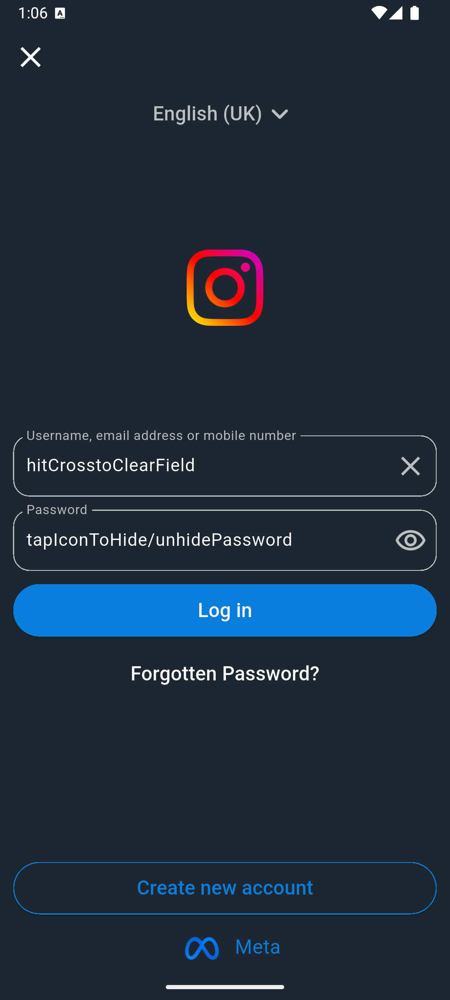
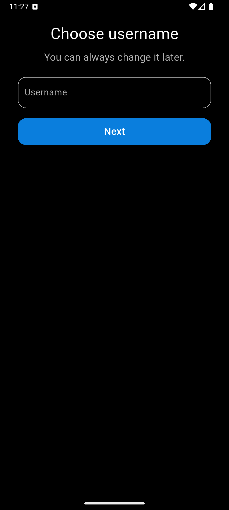
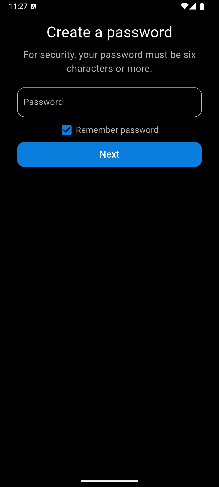
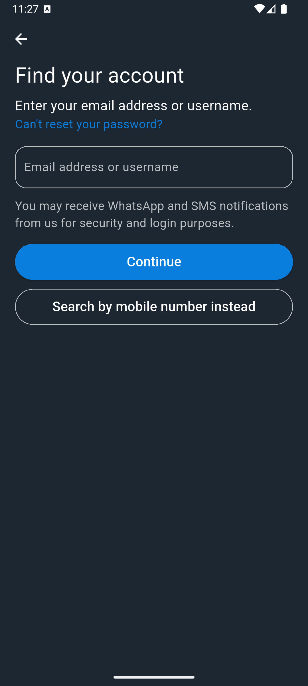
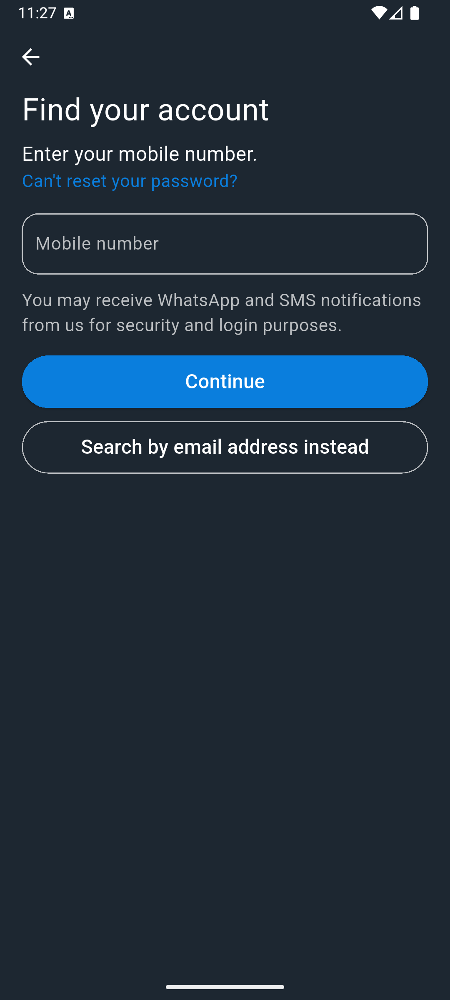
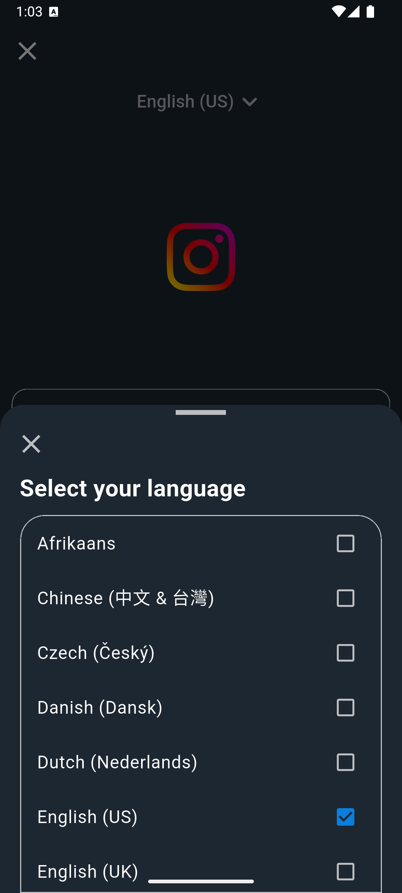

# Instagram UI Clone (Flutter) 📱✨

A UI-only Instagram clone built with Flutter, featuring basic pages like login, signup, and password recovery. The project includes **navigation** between screens and focuses on replicating the look and feel of Instagram's mobile app interface. 🔄

## Features 🚀
- Modern Instagram-style dark-themed UI
- Instagram-style **login page** 🔑 
- **Signup page** to choose a username & password ✍️
- **Forgot password** page for instagram account recovery 🔒
- **Bottom sheet** modal for language selection 🌐
- **Navigation** setup for smooth transitions between pages 🔄
- Centralized styling using constants for colors and input borders 🎨

## Screenshots 📸

<h2>Login Page</h2>

  

<h2>Signup Pages</h2>

  
  

<h2>Forgot Password Pages</h2>

  
  

<h2>Language Modal</h2>

  

## Notes 📝

- This project currently focuses on the **UI design** with no backend functionality.
- A learning project to practice Flutter UI components and basic navigation.
- **Future enhancements** could include form validation, state management, and backend integration with Firebase for user authentication.

## Tech Stack ⚙️

- **Flutter**: Used for building the cross-platform mobile UI.
- **Dart**: Programming language used in Flutter for the development of the app.
- **VS Code / Android Studio**: Integrated Development Environments (IDEs) used for coding and testing the app.
- **Git**: Version control tool for source code management.

